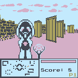

# raycast-wasm4



[](https://github.com/icebox246/raycast-wasm4/actions/workflows/build.yml)

A game written in Zig for the [WASM-4](https://wasm4.org) fantasy console.

## Building

Dependencies:

- `zig` (>=0.11.0)
- `wasm4` (>=2.5.4)

You can install `wasm4` from `npm` with: `npm i -g wasm4`. `zig` can be
downloaded from [here](https://ziglang.org/download/#release-0.11.0).

Build the cart by running:

```shell
zig build gen
zig build -Doptimize=ReleaseSmall
```

Then run it with:

```shell
w4 run zig-out/lib/cart.wasm
```

## Credits

Game created using [WASM-4](https://wasm4.org).
